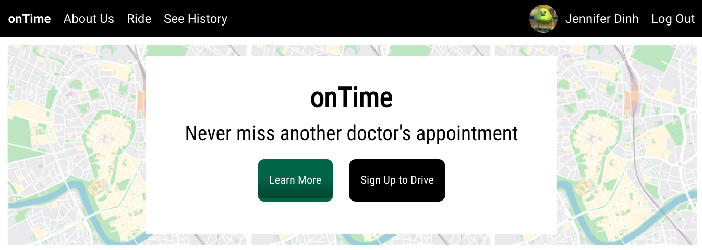
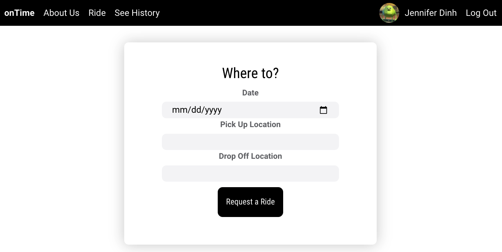
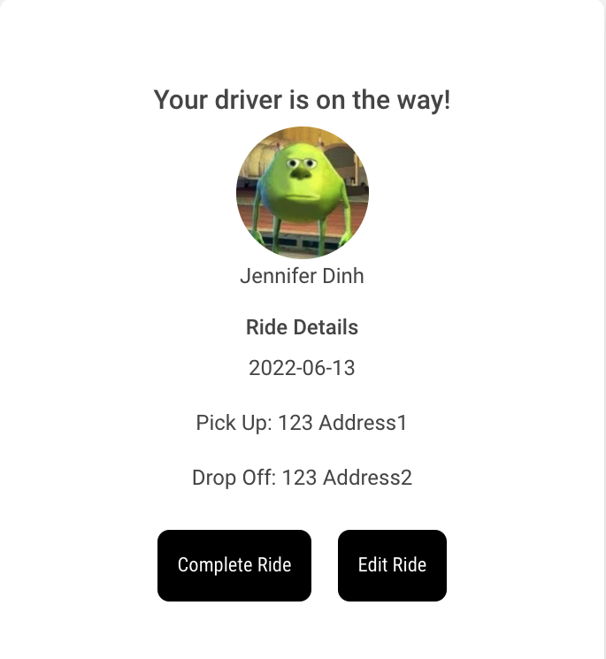

# onTime

onTime is an app created with the intention of providing easy and accessible transportation to your doctor's appointments. Drivers and patients are matched based on language preferences and accessibility to prevent any communication issues.

## Getting Started
[Link to App](https://ontime-1.herokuapp.com/login)

### Technologies Used
- Express
- Javascript
- MongoDB/Mongoose
- Node.js
- React

### Future Improvements
- Implement driver model and have ride requests show up in driver's account
- Implement Google Maps API to show passenger the route of their trip
